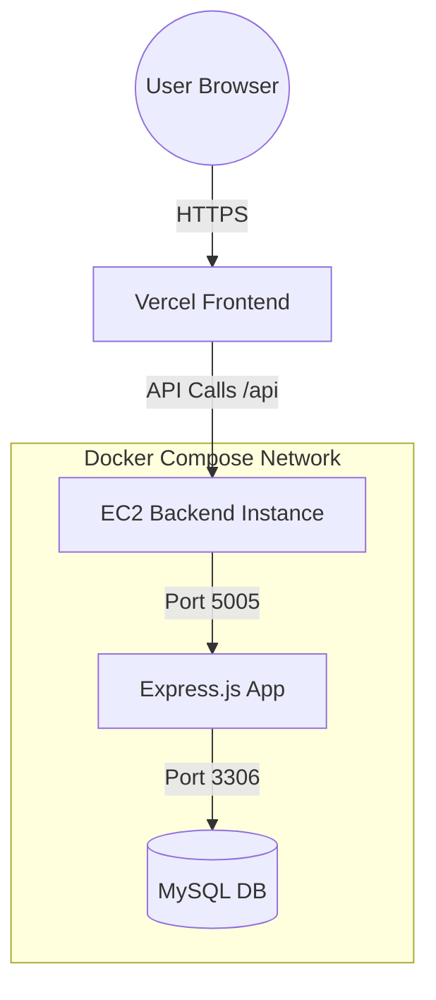

# 💹 Zorvyn Finance Dashboard

[](https://nodejs.org/)
[](https://reactjs.org/)
[](https://www.mysql.com/)
[](https://www.docker.com/)
[](https://opensource.org/licenses/MIT)

**Zorvyn Finance Dashboard** is an enterprise-grade, multi-tenant financial management system. It provides a secure, role-based environment for organizations to track income, expenses, and manage personnel with a complete audit trail.

---

## 🚀 Key Features

- **🏢 Multi-Tenant Architecture**: Strict data isolation between organizations (tenants).
- **🔐 Granular RBAC**: Dynamic Role-Based Access Control managed via database permissions.
- **📜 Audit Transparency**: Comprehensive logging of all financial modifications for compliance.
- **📊 Real-time Analytics**: Instant financial summaries including Net Balance, Income, and Expense tracking.
- **👥 Personnel Management**: Administrator-level controls for provisioning and managing team members.
- **🛠️ Dockerized Environment**: Seamless deployment with pre-configured container orchestration.

---

## 📐 System Architecture



---

## 🛡️ Role-Based Access Control (RBAC) Matrix

| Role | Dashboard | Records (Read) | Records (Write) | Audit Logs | Team Management |
| :--- | :---: | :---: | :---: | :---: | :---: |
| **Super Admin** | ✅ | ✅ | ✅ | ✅ | ✅ |
| **Admin** | ✅ | ✅ | ✅ | ✅ | ✅ |
| **Accountant** | ✅ | ✅ | ✅ | ❌ | ❌ |
| **Auditor** | ✅ | ✅ | ❌ | ✅ | ❌ |
| **Viewer** | ✅ | ❌ | ❌ | ❌ | ❌ |

---

## 🛠️ Technology Stack

- **Frontend**: React, Axios for API orchestration, Vanilla CSS (Premium Aesthetics).
- **Backend**: Node.js & Express.js (ES Modules), Raw MySQL queries for performance.
- **Security**: JWT (JsonWebToken) Auth, Bcrypt password hashing.
- **Infrastructure**: Docker & Docker Compose, Vercel (Front-end), AWS EC2 (Back-end).

---

## ⚙️ Installation & Setup

### 1. Prerequisites
- Docker & Docker Compose
- Node.js v18+ (for local development)

### 2. Environment Configuration
Create a `.env` file in the `server/` directory:
```env
PORT=5005
DB_HOST=db  # Use 'localhost' for local, 'db' for Docker
DB_USER=root
DB_PASSWORD=YourSecurePassword
DB_NAME=zorvyn_finance
JWT_SECRET=your_super_secret_key
NODE_ENV=development
```

### 3. Quick Start (Docker)
Bootstrap the entire environment with a single command:
```bash
docker-compose up --build
```

### 4. Local Development
**Server Setup:**
```bash
cd server
npm install
npm run init-db  # Initializes tables and seeds default roles/users
npm run dev
```

**Client Setup:**
```bash
cd client
npm install
npm start
```

---

## 🔐 Default Credentials (Test Environment)
| Identity | Password |
| :--- | :--- |
| `superadmin@zorvyn.com` | `password123` |
| `accountant@zorvyn.com` | `password123` |
| `auditor@zorvyn.com` | `password123` |

---

## 📄 License
Distributed under the MIT License. See `LICENSE` for more information.

---
*Developed by the Zorvyn Engineering Team.*
