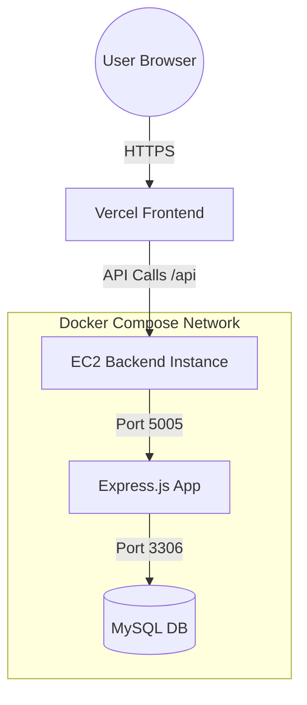

# Zorvyn Finance Dashboard

**Zorvyn Finance Dashboard** is an enterprise-grade, multi-tenant financial management system. It provides a secure, role-based environment for organizations to track income, expenses, and manage personnel with a complete audit trail.

---

## 🚀 Completed Deliverables

### 🏗️ Backend Core & Architecture
- **Modular REST API**: Built with a scalable architecture following the **Controller-Service-Model** pattern.
- **Clean Separation of Concerns**: Distinct layers for routes, controllers, business logic (services), and data models.
- **Persistent Storage**: Integrated with **MySQL** for robust data persistence and schema integrity.
- **Scalable Structure**: Optimized for enterprise-level data handling and easy feature expansion.

### 🔐 Security & Access Control
- **Granular RBAC**: Dynamic Role-Based Access Control (Super Admin, Admin, Accountant, Auditor, Viewer).
- **Multi-Tenancy Support**: Strict **Organization-Based Data Isolation**, ensuring users only see data belonging to their tenant.
- **JWT Authentication**: Secure stateless authentication using JSON Web Tokens.
- **Middleware-Based Authorization**: API-level protection to prevent unauthorized actions and data leaks.
- **Input Validation**: Comprehensive sanitization and validation across all API endpoints.

### 💰 Financial Management & Ledger
- **Full CRUD Operations**: Complete control over financial records (Income and Expense tracking).
- **Structured Ledger System**: Organization-specific financial tracking with precision decimal handling.
- **Audit Trail**: Real-time logging of all `CREATE`, `UPDATE`, and `DELETE` operations for compliance and transparency.
- **Dashboard Analytics APIs**:
    - Aggregated totals for Income, Expenses, and Net Balance.
    - Category-wise financial breakdowns.
    - Retrieval of recent transactions for operational oversight.

### 👥 User & Organization Management
- **Organization Provisioning**: Ability to create new tenant workspaces during registration.
- **Team Management**: Super Admin and Admin tools for inviting team members and assigning roles.
- **Seeded Demo Environment**: Pre-configured test accounts for instant feature exploration.

---

## 📐 System Architecture

---

## 🛡️ Role-Based Access Control (RBAC) Matrix

| Role | Dashboard | Records (Read) | Records (Write/Edit) | Audit Logs | Team Management |
| :--- | :---: | :---: | :---: | :---: | :---: |
| **Super Admin** | ✅ | ✅ | ✅ | ✅ | ✅ |
| **Admin** | ✅ | ✅ | ✅ | ✅ | ✅ |
| **Accountant** | ✅ | ✅ | ✅ | ❌ | ❌ |
| **Auditor** | ✅ | ✅ | ❌ | ✅ | ❌ |
| **Viewer** | ✅ | ❌ | ❌ | ❌ | ❌ |

---
## 🔌 API Documentation

All API requests are prefixed with `/api`.

### 🔐 Authentication & Authorization
| Method | Endpoint | Description | Auth Required |
| :--- | :--- | :--- | :---: |
| `POST` | `/auth/register` | Register new organization/admin | ❌ |
| `POST` | `/auth/login` | Login and receive JWT | ❌ |

### 💰 Financial Records
| Method | Endpoint | Description | Permission Required |
| :--- | :--- | :--- | :--- |
| `GET` | `/records` | Fetch all records for the organization | `read:records` |
| `POST` | `/records` | Create a new income/expense entry | `create:records` |
| `PUT` | `/records/:id` | Update an existing record | `update:records` |
| `DELETE` | `/records/:id` | Remove a record | `delete:records` |

### 📊 Dashboard & Analytics
| Method | Endpoint | Description | Permission Required |
| :--- | :--- | :--- | :--- |
| `GET` | `/records/dashboard` | Get financial overview & aggregates | `read:dashboard` |
| `GET` | `/records/audit-logs` | Fetch system audit trails | `read:audit_logs` |

### 👥 Team Management
| Method | Endpoint | Description | Permission Required |
| :--- | :--- | :--- | :--- |
| `GET` | `/auth/team` | List all organization members | `read:dashboard` |
| `POST` | `/auth/team` | Add / Invite a new team member | `manage:team` |

