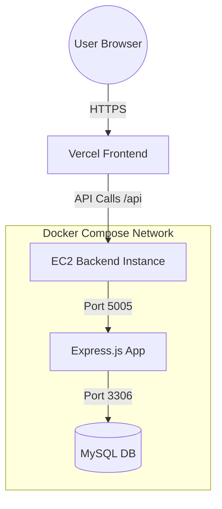

# 💹 Zorvyn Finance Dashboard

[](https://nodejs.org/)
[](https://reactjs.org/)
[](https://www.mysql.com/)
[](https://www.docker.com/)
[](https://opensource.org/licenses/MIT)

**Zorvyn Finance Dashboard** is an enterprise-grade, multi-tenant financial management system. It provides a secure, role-based environment for organizations to track income, expenses, and manage personnel with a complete audit trail.

---

## 🚀 Completed Deliverables

### 🏗️ Backend Core & Architecture
- **Modular REST API**: Built with a scalable architecture following the **Controller-Service-Model** pattern.
- **Clean Separation of Concerns**: Distinct layers for routes, controllers, business logic (services), and data models.
- **Persistent Storage**: Integrated with **MySQL** for robust data persistence and schema integrity.
- **Scalable Structure**: Optimized for enterprise-level data handling and easy feature expansion.

### 🔐 Security & Access Control
- **Granular RBAC**: Dynamic Role-Based Access Control (Super Admin, Admin, Accountant, Auditor, Viewer).
- **Multi-Tenancy Support**: Strict **Organization-Based Data Isolation**, ensuring users only see data belonging to their tenant.
- **JWT Authentication**: Secure stateless authentication using JSON Web Tokens.
- **Middleware-Based Authorization**: API-level protection to prevent unauthorized actions and data leaks.
- **Input Validation**: Comprehensive sanitization and validation across all API endpoints.

### 💰 Financial Management & Ledger
- **Full CRUD Operations**: Complete control over financial records (Income and Expense tracking).
- **Structured Ledger System**: Organization-specific financial tracking with precision decimal handling.
- **Audit Trail**: Real-time logging of all `CREATE`, `UPDATE`, and `DELETE` operations for compliance and transparency.
- **Dashboard Analytics APIs**:
    - Aggregated totals for Income, Expenses, and Net Balance.
    - Category-wise financial breakdowns.
    - Retrieval of recent transactions for operational oversight.

### 👥 User & Organization Management
- **Organization Provisioning**: Ability to create new tenant workspaces during registration.
- **Team Management**: Super Admin and Admin tools for inviting team members and assigning roles.
- **Seeded Demo Environment**: Pre-configured test accounts for instant feature exploration.

---

## 📐 System Architecture



---

## 🛡️ Role-Based Access Control (RBAC) Matrix

| Role | Dashboard | Records (Read) | Records (Write/Edit) | Audit Logs | Team Management |
| :--- | :---: | :---: | :---: | :---: | :---: |
| **Super Admin** | ✅ | ✅ | ✅ | ✅ | ✅ |
| **Admin** | ✅ | ✅ | ✅ | ✅ | ✅ |
| **Accountant** | ✅ | ✅ | ✅ | ❌ | ❌ |
| **Auditor** | ✅ | ✅ | ❌ | ✅ | ❌ |
| **Viewer** | ✅ | ❌ | ❌ | ❌ | ❌ |

---

## 🛠️ Technology Stack

- **Frontend**: React (Hooks, Context API), AxiOS, Vanilla CSS (Modern Enterprise UI).
- **Backend**: Node.js, Express.js (ES Modules), MySQL (raw performance queries).
- **Security**: JWT, Bcrypt.js, custom Auth Middleware.
- **Infrastructure**: Docker, AWS EC2, Vercel.

---

## ⚙️ Installation & Setup

### 1. Prerequisites
- Docker & Docker Compose
- Node.js v18+

### 2. Environment Configuration
Create a `.env` file in the `server/` directory:
```env
PORT=5005
DB_HOST=db  # Use 'localhost' for local, 'db' for Docker
DB_USER=root
DB_PASSWORD=YourSecurePassword
DB_NAME=zorvyn_finance
JWT_SECRET=your_super_secret_key
NODE_ENV=development
```

### 3. Quick Start (Docker)
```bash
docker-compose up --build
```

### 4. Seed Database
To initialize the schema and roles:
```bash
cd server
npm run init-db
```

---

## 🔐 Default Credentials (Demo Access)
| Identity | Password | Role |
| :--- | :--- | :--- |
| `superadmin@zorvyn.com` | `password123` | Super Admin |
| `accountant@zorvyn.com` | `password123` | Accountant |
| `auditor@zorvyn.com` | `password123` | Auditor |
| `viewer@zorvyn.com` | `password123` | Viewer |

---

## 📄 License
Distributed under the MIT License. See `LICENSE` for more information.

---
**Developed by Kalash Harchandani**  
[GitHub Profile](https://github.com/Kalash-Harchandani) | [LinkedIn](https://linkedin.com/in/kalash-kt20)
